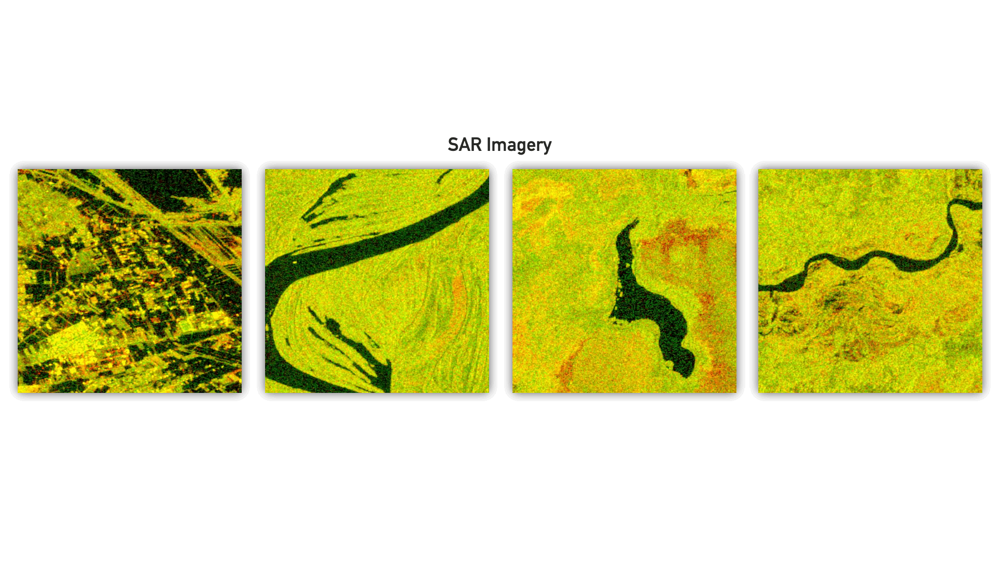

# Post-hoc Uncertainty Estimation

    

## Usage
It is suggested to open the repository with PyCharm. Afterwards, install libraries from the `requirements.txt`. For PyCharm usage we suggest to tick _"Emulate terminal in output console"_ for a configuration. Code was developed and tested under Python 3.10.

The repository contains two main targets to execute. For the flood segmentation experiments we have the following:
- `example_projects/example_uncertainty_project/source/main.py`
- `example_script/flood_uncertainty.py`

We support the following uncertainty quantification methods:
1. Student ensembles
2. Test-time data augmentation
3. Monte Carlo dropout
4. Weight noise
5. Softmax estimation

The `W2` directory contains all uncertainty estimation source code. Create a new `UC` object to apply these various methods and multiple quantification metrics. When using the package, read in your model and use it as an input parameter during initalization. After reading your inference images, use them as an argument for `UC.predict()` to receive your uncertainty maps. Please have a look into `example_script/flood_uncertainty.py` for an example call and usage. If you are interested for an insight into the functionality of the estimation, please look into the documentation within the corresponding class of `W2/UC.py`. Besides `UC.predict()` an `UC` object contains the following methods for analyzing uncertainty results further:
- `UC.generate_calibration_curves()` to plot calibration curves based on the reference model calibration.
- `UC.evaluate_uncertainty_vs_error()` to estimate if the reference model error increases with uncertainty.
- `UC.evaluate_metric_correlation()` to validate if metrics correlate.
- `UC.evaluate_method_correlation()` to verify if methods correlate.

### Example script
With respect to the example flood segmentation script, execute `flood_uncertainty.py` within the `example_script` folder.

#### Model saves
The reference model is placed under the `example_script` folder. When using student ensembles, student models should be added under `example_script/student_ensemble`.

#### Example data
Place your image file for uncertainty analysis under the `example_script` root directory as well. Then change the image loading in the `flood_uncertainty.py` script.

#### Uncertainty methods
Define methods for analysis, their input parameters and quantification metrics when creating the `UC` object and calling `UC.predict()` in the script.

#### Results
Results are also saved under the `example_script` root directory. We get the resulting uncertainty map for each stated uncertainty estimation method in the script.

### SAR flood detection project
For running the corresponding example project, mark the `source` directory within `example_uncertainty_project` as a source folder and as the working directory for the run configuration.
Then just execute the corresponding listed `main.py`.

#### Arguments
The following arguments are supported for the example project:
- `--teacher-epochs`; default: 100; For training a reference teacher model.
- `--batch-size`; default: 24
- `--dataset-path`; State your input dataset path for training/validation/testing and uncertainty inference.
- `--gpu`; To state which gpu to use.
- `--num-workers`; default: 1
- `--students`; default: 50; Number of student models when training a student ensemble.
- `--student-epochs`; default: 100; For training student models.
- `--pretrained-teacher`; default: `true`; State whether a new reference model should be trained or is already trained.

#### Model saves
The reference model is placed under `example_projects/example_uncertainty_project/model_saves/teacher`. When using student ensembles, use the corresponding `students` folder under the same path.

#### Dataset
Place the dataset under the path of the modifiable `--dataset-path` execution argument.

#### Uncertainty methods
Methods and metrics are again stated in a `UC` object and `UC.predict()` method.

#### Results
Results are saved under `example_projects/example_uncertainty_project/results` and include calibration curves, example output uncertainty maps, correlations and error curves.

## Dataset
###### Bonafilia, D., Tellman, B., Anderson, T., Issenberg, E. 2020. [Sen1Floods11: a georeferenced dataset to train and test deep learning flood algorithms for Sentinel-1](https://github.com/cloudtostreet/Sen1Floods11). The IEEE/CVF Conference on Computer Vision and Pattern Recognition (CVPR) Workshops, 2020, pp. 210-211.
