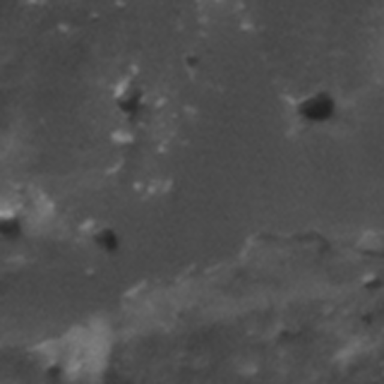
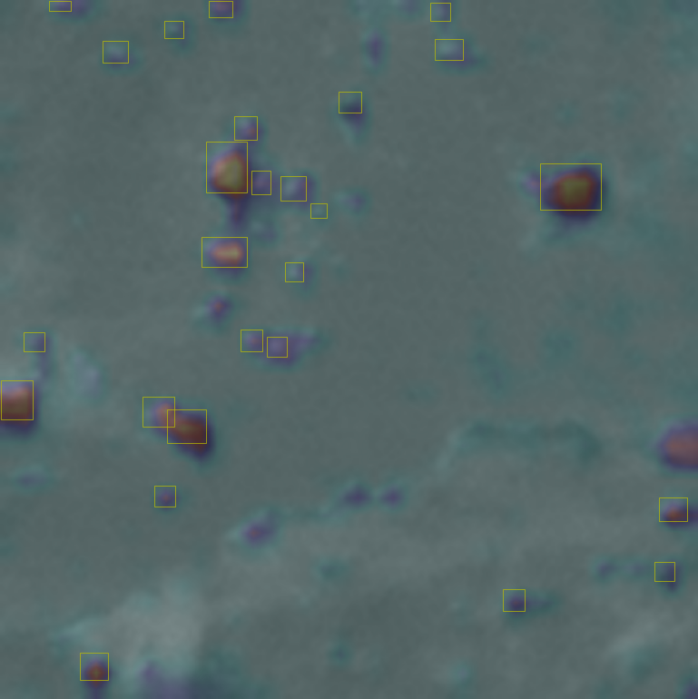
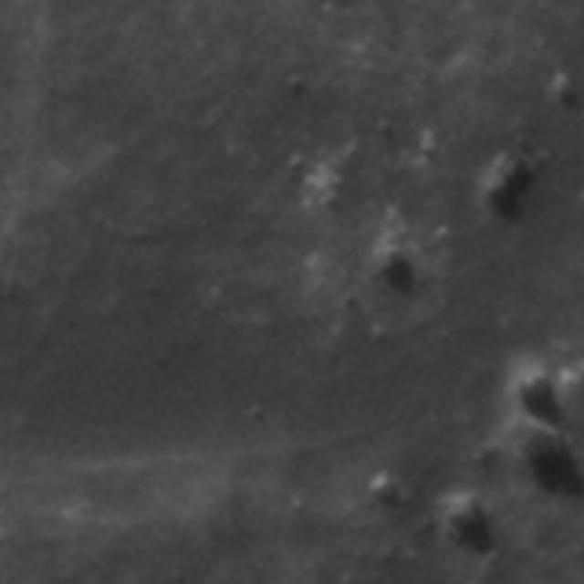
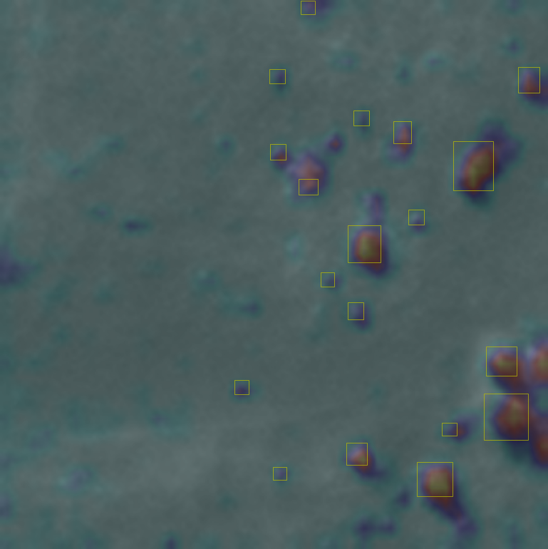
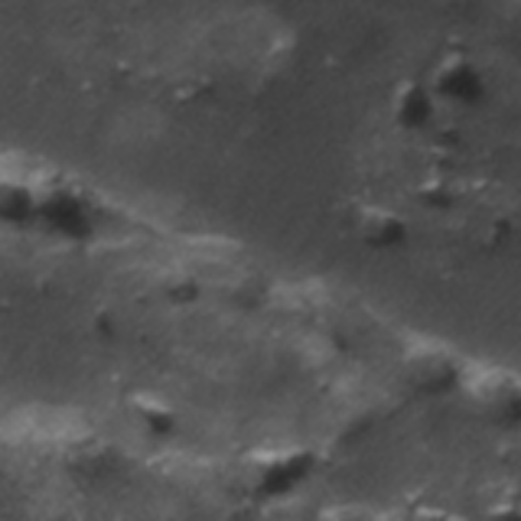
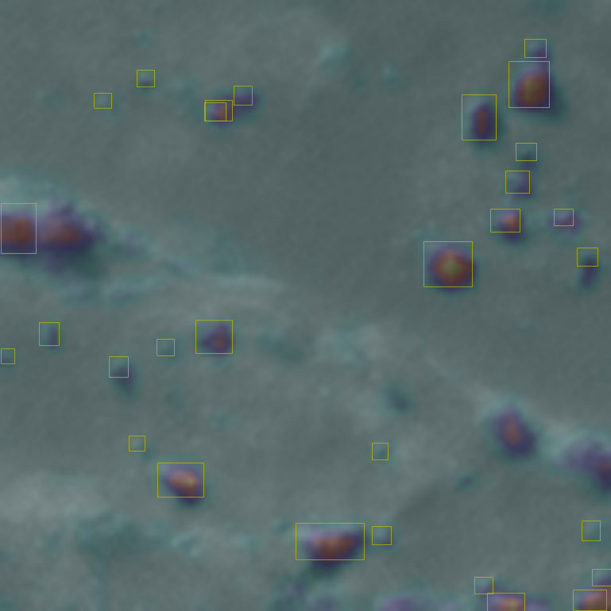
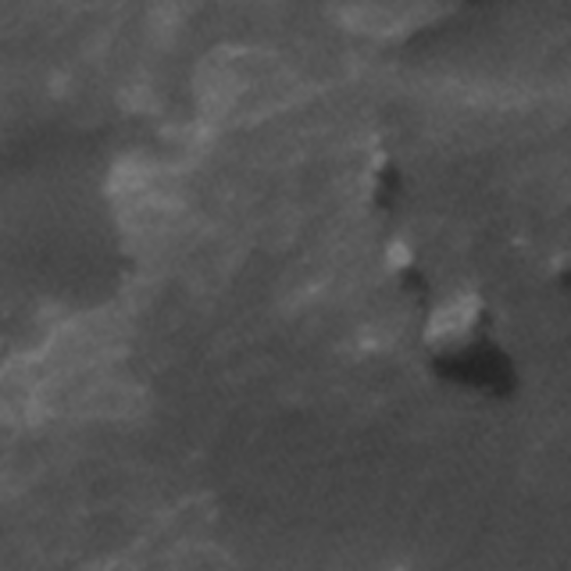
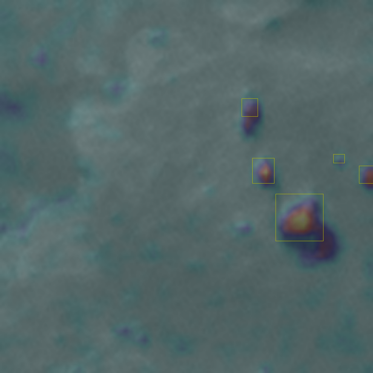
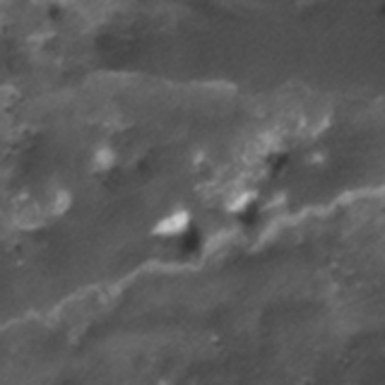
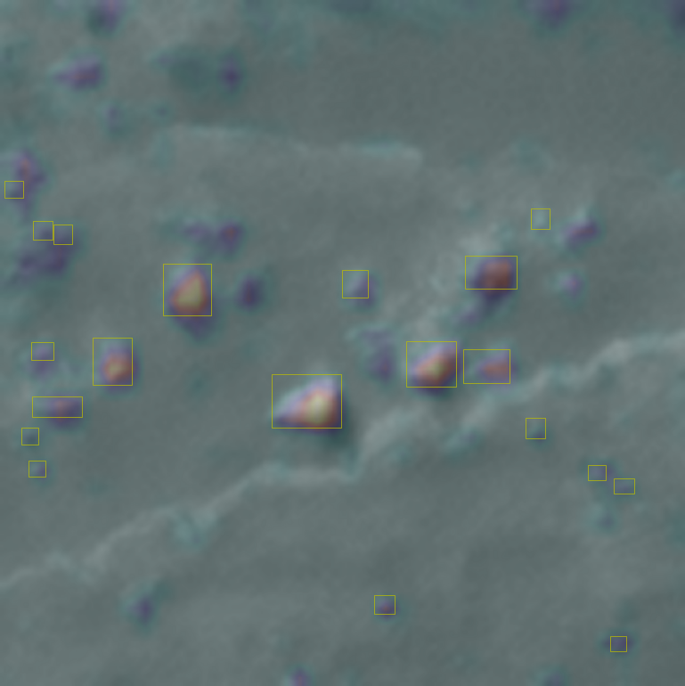

# EigenCam for YOLO object detection

This is a demo of a GradCam output on a YOLOv8s model. This particular network was trained to detect ice blocks in
the Mars North Polar region. If you wish to run the <em>camtest.ipynb</em> yourself I first suggest running:

```
pip install ultralytics
```

This will install additional yolo dependencies on top of those required for EigenCam (needed to load the model using the YOLO wrapper).

### Results

OG Images             |  EigenCam
:-------------------------:|:-------------------------:
 | 
 | 
 | 
 | 
 | 
